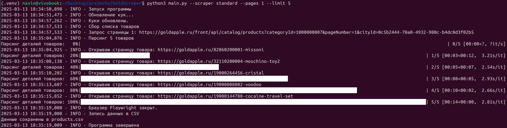
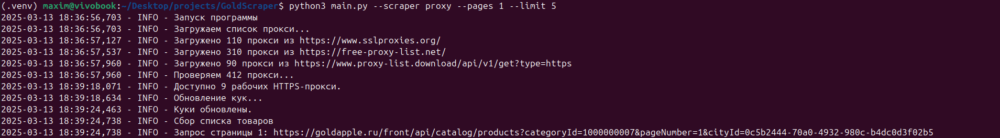
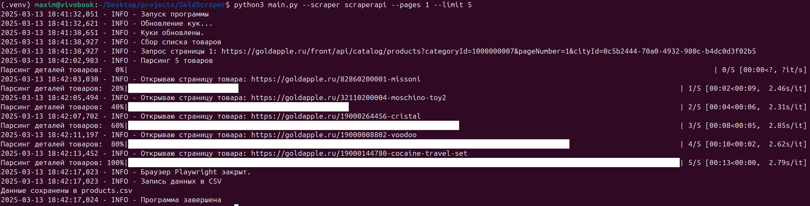
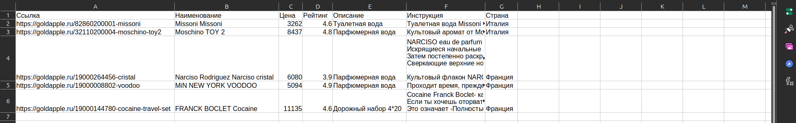
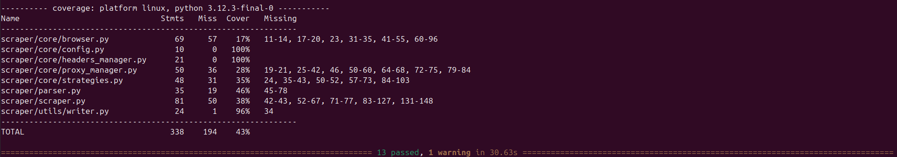

# Gold Scraper


---

## Описание проекта:

Gold Scraper - это инструмент для парсинга данных о товарах с сайта
[Gold Apple - Парфюмерия](https://goldapple.ru/parfjumerija).
Проект позволяет собирать информацию о товарах:

- ссылка
- название
- цена
- рейтинг
- описание
- инструкция по применению
- страна происхождения

из API и страниц товаров с использованием `Playwright` и `Requests`.

Поддерживаются различные стратегии скрапинга:

- стандартный запрос;
- через прокси;
- ScraperAPI.

---

## Стек технологий:

- Python 3.10+
- requests
- playwright

---

Как настроить проект локально:

1. **Клонируйте репозиторий:**

   ```bash
   git clone https://github.com/MaksimIpatov/GoldScraper.git && cd GoldScraper
   ```

2. **Создайте виртуальное окружение и активируйте его:**

```bash
# Linux/Mac
python3 -m venv .venv
source .venv/bin/activate

# Windows
python -m venv .venv
.venv\Scripts\activate     
```

3. **Установите зависимости:**

```bash
# Linux/Mac
pip install -r requirements.txt

# Windows
pip install -r requirements.txt
```

4. **Установите Playwright и браузеры:**

```bash
playwright install
```

5. **Настройте переменные окружения:**

- Скопируйте `env.sample` в `.env`:

```bash
cp env.sample .env
```

- Укажите ваш ключ [ScraperAPI](https://www.scraperapi.com/) в `.env` (опционально):

---

## Использование

Базовый запуск:

```bash
# Linux/MacOS
python3 main.py

# Windows
python main.py
```

Запустите скрипт через командную строку с нужными параметрами:

```bash
# Linux/Mac
python3 main.py --scraper standard --pages 1 --limit 5 --verbose

# Windows
python main.py --scraper standard --pages 1 --limit 5 --verbose
```

- **Аргументы CLI**
    - `--scraper`: Тип скрапера (`standard`, `proxy`, `scraperapi`). По умолчанию: `standard`.
    - `--pages`: Количество страниц для парсинга. По умолчанию: `5`.
    - `--limit`: Ограничение на количество товаров. По умолчанию: нет лимита.
    - `--verbose`: Включить подробное логирование (`DEBUG` уровень).

- **Пример вывода**
    - Результаты сохраняются в `products.csv`.
    - Логи записываются в `scraper.log`.

---

## Примеры работы

### 1. Стандартный режим:



### 2. Прокси режим:



### 3. Прокси режим:



### 4. Результат в CSV:



---

> [Техническое задание](./TASKS.md)

## Тесты

### Запуск тестов с измерением покрытия:

```bash
pytest --cov=scraper --cov-report=term-missing tests/
```


